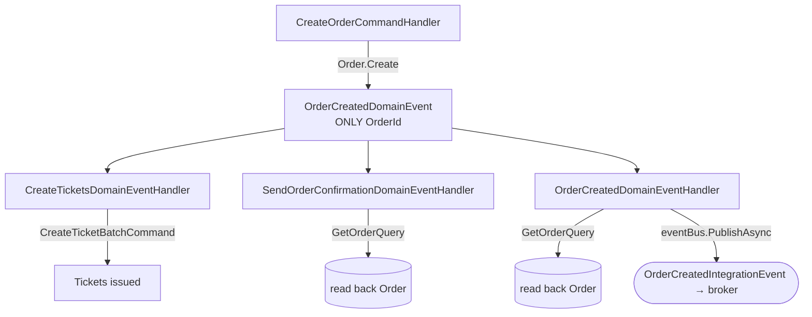
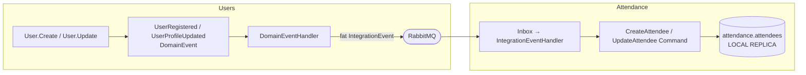
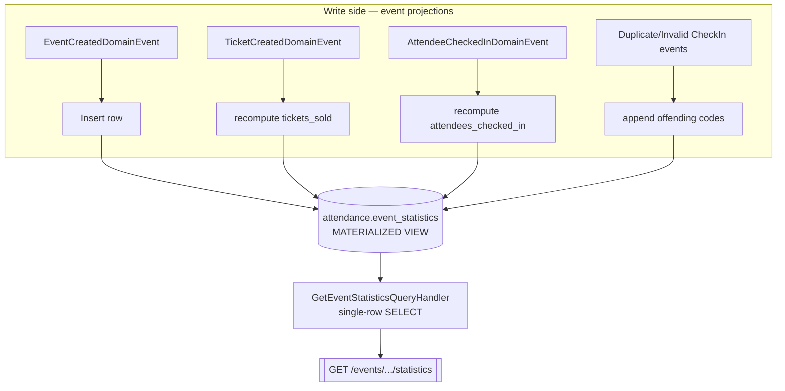

# Event-Driven Patterns in Evently

A deep dive into the three event-driven patterns used in this modular monolith, grounded in the actual code:

1. **Event Notification** — Orders (`Ticketing` module)
2. **Event-Carried State Transfer (ECST)** — Users → Attendance
3. **Materialized View + CQRS** — `EventStatistics` (`Attendance` module)

The application (see `docs/structure.png`) is a **modular monolith**: four independently-schemad modules — `Events`, `Ticketing`, `Attendance`, `Users` — each owning its own PostgreSQL schema (`events.*`, `ticketing.*`, `attendance.*`, `users.*`), talking to each other **only through a message broker** (RabbitMQ via MassTransit). No module reaches into another module's tables.

Two levels of eventing coexist and must not be confused:

| Level | Name | Scope | Transport | Base type |
|-------|------|-------|-----------|-----------|
| Inside a module | **Domain event** | In-process, same DB transaction | MediatR (in-memory) | `IDomainEvent` |
| Between modules | **Integration event** | Cross-module, cross-schema | RabbitMQ / MassTransit | `IntegrationEvent` |

The bridge between the two levels is the **Outbox**: a domain-event handler publishes an integration event onto the bus. The bridge on the receiving side is the **Inbox**: an integration-event handler translates it back into a local command.

```
        ┌─────────────── one module ───────────────┐
Command ─► Aggregate.Raise(DomainEvent) ─► [same TX, Outbox] ─► DomainEventHandler
                                                                      │
                                                                      ▼
                                                            eventBus.PublishAsync(IntegrationEvent)
                                                                      │
        ═══════════════════ RabbitMQ (broker) ════════════════════════╪══════════
                                                                      ▼
        ┌───────────── another module ─────────────┐        Inbox ─► IntegrationEventHandler ─► Command
```

---

## Shared infrastructure: Outbox / Inbox / Idempotency

Every module carries the same reliability plumbing. Understanding it once explains all three patterns.

- **Outbox** (`.../Infrastructure/Outbox/`) — when an aggregate is saved, its raised domain events are persisted into `<schema>.outbox_messages` **inside the same transaction** as the business data. `ProcessOutboxJob` later reads them and dispatches to domain-event handlers. This guarantees the event is never lost if the process crashes after commit (the classic "dual-write" problem).
- **Inbox** (`.../Infrastructure/Inbox/`) — `IntegrationEventConsumer<T>` does **not** process an incoming broker message directly. It only writes it into `<schema>.inbox_messages` (see `IntegrationEventConsumer.cs`). `ProcessInboxJob` then hands it to the real `IntegrationEventHandler`. This decouples broker delivery from business processing and makes retries safe.
- **Idempotency** — because the broker is at-least-once, handlers can run twice.
  - `IdempotentDomainEventHandler` (decorator) records `(outbox_message_id, handler_name)` in `outbox_message_consumers`; if the row exists, it skips. This lets *N* handlers each consume the same event exactly once.
  - `IdempotentIntegrationEventHandler` does the same for the inbox side.

> **Takeaway:** all three patterns ride on top of at-least-once delivery + idempotent, transactional handlers. The pattern differences are about **what the event carries** and **who owns the resulting data**, not about the transport.

---

## Pattern 1 — Event Notification (Orders / Ticketing)

> "Something happened; if you care, come and ask me for the details."

### Definition
An **event notification** is a *thin* event. It announces that a state change occurred and carries little more than an **identifier**. Interested parties react by **calling back** to the source to fetch whatever data they need. The event is a doorbell, not a delivery.

### Trigger & workflow
Entry point: `CreateOrderCommandHandler` (`Ticketing.Application/Orders/CreateOrder/`).

1. A customer checks out. `CreateOrderCommandHandler.Handle`:
   - Opens an explicit DB transaction.
   - Loads the `Customer` and the `Cart` (cart lives in the distributed cache via `CartService`).
   - For each cart item, acquires a **pessimistic lock** on the `TicketType` (`GetWithLockAsync`) and decrements available quantity — this is where overselling is prevented.
   - Builds the `Order`, inserts it, fakes a payment (`IPaymentService.ChargeAsync`), inserts a `Payment`.
   - `SaveChangesAsync` + `CommitAsync`, then clears the cart.

2. The `Order` aggregate itself raises the notification in its factory:

```csharp
// Ticketing.Domain/Orders/Order.cs
public static Order Create(Customer customer)
{
    var order = new Order { /* ... */ Status = OrderStatus.Pending };
    order.Raise(new OrderCreatedDomainEvent(order.Id));   // ← THIN: only the Id
    return order;
}
```

`OrderCreatedDomainEvent` carries **only `OrderId`**. That is the defining trait of this pattern.

### Data flow — fan-out with call-back
Three independent domain-event handlers subscribe to the same `OrderCreatedDomainEvent`, each running once (idempotent), each **querying back** for the state it needs:

| Handler | Reaction | How it gets data |
|---------|----------|------------------|
| `CreateTicketsDomainEventHandler` | Sends `CreateTicketBatchCommand(OrderId)` to issue tickets | passes only the id |
| `SendOrderConfirmationDomainEventHandler` | Sends confirmation notification | `GetOrderQuery(OrderId)` → full `OrderResponse` |
| `OrderCreatedDomainEventHandler` | Publishes the **integration** event to the broker | `GetOrderQuery(OrderId)` → full `OrderResponse` |

```csharp
// OrderCreatedDomainEventHandler.cs — notification handler calls BACK for state
Result<OrderResponse> result = await sender.Send(new GetOrderQuery(notification.OrderId), ct);
await eventBus.PublishAsync(new OrderCreatedIntegrationEvent(/* fields copied from result.Value */), ct);
```



### Why it is used here
- **Decoupling by ignorance.** `Order.Create` does not know or care that tickets, confirmations, and integration events will be produced. New reactions are added by writing a new handler — the aggregate never changes. This is open/closed at the event level.
- **Always-fresh data.** Because handlers re-read through `GetOrderQuery` at the moment they run, they never act on stale, serialized snapshots. If the order was enriched between raise and handling, they see the latest.
- **Small events.** The event payload stays tiny and stable; you don't version a big schema every time `OrderResponse` grows.

### Trade-offs
- **Chattier.** Each handler issues its own query — N handlers ⇒ N reads back to the source.
- **Temporal coupling.** The source must still be reachable/consistent when the handler runs. Here it always is, because domain-event handlers run **in-process, in the same module, right after commit**.

---

## Pattern 2 — Event-Carried State Transfer (Users → Attendance)

> "Something happened, and here is *all the data you need* — keep your own copy."

### Definition
An **ECST** event is *fat*. It carries the full business state of the change so that **downstream modules can maintain their own local replica** and never have to call back to the source. This trades storage/duplication for **autonomy**: the consumer keeps working even if the producer is down.

### Trigger & workflow (source = Users module)
Two write paths in the `Users` module raise fat domain events:

```csharp
// Users.Domain/Users/User.cs
public static User Create(string email, string firstName, string lastName, string identityId)
{
    var user = new User { /* ... */ };
    user._roles.Add(Role.Member);
    user.Raise(new UserRegisteredDomainEvent(user.Id));
    return user;
}

public void Update(string firstName, string lastName)
{
    if (FirstName == firstName && LastName == lastName) return;   // no-op guard
    FirstName = firstName;
    LastName = lastName;
    Raise(new UserProfileUpdatedDomainEvent(Id, FirstName, LastName));  // ← carries state
}
```

The domain-event handler translates the domain event into a **state-carrying integration event** and puts it on the broker:

```csharp
// Users.Application/Users/UpdateUser/UserProfileUpdatedDomainEventHandler.cs
await eventBus.PublishAsync(
    new UserProfileUpdatedIntegrationEvent(
        domainEvent.Id, domainEvent.OccurredOnUtc,
        domainEvent.UserId, domainEvent.FirstName, domainEvent.LastName),  // FULL state on the wire
    cancellationToken);
```

Compare the integration event shapes — they are deliberately **fat**:

| Integration event | Fields carried |
|-------------------|----------------|
| `UserRegisteredIntegrationEvent` | `UserId, Email, FirstName, LastName` |
| `UserProfileUpdatedIntegrationEvent` | `UserId, FirstName, LastName` |

Notice there is **no `GetUserQuery` callback** anywhere downstream — everything needed travels in the payload.

### Impact on the Attendance module (the consumer)
`Attendance` maintains its **own `Attendee` table** — a replica of the slice of user data it cares about. It builds and updates that replica purely from the incoming events:

```csharp
// Attendance.Presentation/Attendees/UserRegisteredIntegrationEventHandler.cs
await sender.Send(new CreateAttendeeCommand(
    integrationEvent.UserId, integrationEvent.Email,
    integrationEvent.FirstName, integrationEvent.LastName), ct);

// Attendance.Presentation/Attendees/UserProfileUpdatedIntegrationEventHandler.cs
await sender.Send(new UpdateAttendeeCommand(
    integrationEvent.UserId, integrationEvent.FirstName, integrationEvent.LastName), ct);
```

The command handlers just persist locally — no cross-module lookups:

```csharp
// Attendance.Application/Attendees/CreateAttendee/CreateAttendeeCommandHandler.cs
var attendee = Attendee.Create(request.AttendeeId, request.Email, request.FirstName, request.LastName);
attendeeRepository.Insert(attendee);
await unitOfWork.SaveChangesAsync(cancellationToken);
```



The same ECST pattern also flows **Ticketing → Attendance** for tickets: `TicketCreatedDomainEventHandler` (Ticketing) publishes a fat `TicketIssuedIntegrationEvent(TicketId, CustomerId, EventId, Code)`; Attendance's `TicketIssuedIntegrationEventHandler` sends `CreateTicketCommand` and stores its own `Ticket` row. By the time anyone checks in, Attendance already holds a self-sufficient copy of attendees **and** tickets.

### Why it is used here
- **Runtime autonomy.** Attendance can validate check-ins even if the `Users` (or `Ticketing`) module is offline — it owns the data it reads.
- **No cross-schema queries.** The modular-monolith rule "a module only touches its own schema" is preserved. Attendance never selects from `users.*`.
- **Read performance at check-in.** Check-in is latency-sensitive (people queuing at a door); a local `attendees`/`tickets` table means no network hop to another module.

### Trade-offs
- **Data duplication & eventual consistency.** The attendee's name exists in both `users.users` and `attendance.attendees`. After a profile edit there is a short window where they disagree until the event is processed.
- **Payload versioning.** Fat events couple the wire schema to the producer's fields; changing them requires care (add-only, tolerant readers).
- **Ordering.** If `UserProfileUpdated` were ever processed before `UserRegistered`, the update would fail — mitigated here because registration always precedes updates and the inbox retries.

---

## Pattern 3 — Materialized View + CQRS (EventStatistics / Attendance)

> "Continuously fold a stream of events into a pre-computed, read-optimized table; serve reads straight from it."

### Definition
**CQRS** splits the model that handles writes from the model that serves reads. A **materialized view** is a denormalized, pre-aggregated table kept up to date by **projecting** events as they occur, so queries become a trivial single-row `SELECT` with no joins or aggregation at read time.

Here the read model is the `attendance.event_statistics` table, described by the plain projection class:

```csharp
// Attendance.Domain/Events/EventStatistics.cs — NOT an aggregate, no behavior/events
public sealed class EventStatistics
{
    public Guid EventId { get; private set; }
    public string Title { get; private set; }
    // ...
    public int TicketsSold { get; private set; }
    public int AttendeesCheckedIn { get; private set; }
    public List<string> DuplicateCheckInTickets { get; private set; }
    public List<string> InvalidCheckInTickets { get; private set; }
}
```

### The write side — projection handlers (`EventStatistics/Projections/`)
Each relevant domain event has a handler that mutates the view with **raw Dapper SQL** (bypassing the EF write model entirely — it is a read store):

| Domain event (trigger) | Projection handler | Effect on `event_statistics` |
|------------------------|--------------------|------------------------------|
| `EventCreatedDomainEvent` | `EventCreatedDomainEventHandler` | `INSERT` a new row, counters = 0 |
| `TicketCreatedDomainEvent` | `TicketCreatedDomainEventHandler` | recompute `tickets_sold` |
| `AttendeeCheckedInDomainEvent` | `AttendeeCheckedInDomainEventHandler` | recompute `attendees_checked_in` |
| `DuplicateCheckInAttemptedDomainEvent` | `DuplicateCheckInAttemptedDomainEventHandler` | append to `duplicate_check_in_tickets` |
| `InvalidCheckInAttemptedDomainEvent` | `InvalidCheckInAttemptedDomainEventHandler` | append to `invalid_check_in_tickets` |

```csharp
// EventCreatedDomainEventHandler.cs — seed the row
INSERT INTO attendance.event_statistics(event_id, title, ..., tickets_sold, attendees_checked_in, ...)
VALUES (@EventId, @Title, ..., 0, 0, ...)

// AttendeeCheckedInDomainEventHandler.cs — fold a check-in into the counter
UPDATE attendance.event_statistics es
SET attendees_checked_in = (
    SELECT COUNT(*) FROM attendance.tickets t
    WHERE t.event_id = es.event_id AND t.used_at_utc IS NOT NULL)
WHERE es.event_id = @EventId
```

Note these recompute the aggregate from the source `tickets` table rather than doing `+= 1`; that makes the projection **self-healing and idempotent** — replaying an event yields the same count.

### The read side — a pure query handler
Reads never touch the domain or do aggregation. `GetEventStatisticsQueryHandler` opens a raw connection and selects the single pre-built row with Dapper:

```csharp
// EventStatistics/GetEventStatistics/GetEventStatisticsQueryHandler.cs
SELECT event_id AS EventId, title AS Title, ..., tickets_sold AS TicketsSold,
       attendees_checked_in AS AttendeesCheckedIn, ...
FROM attendance.event_statistics
WHERE event_id = @EventId
```

Exposed through `EventStatistics/GetEventStatistics.cs` (Presentation) as a GET endpoint. `IQueryHandler` (read) and `ICommandHandler` (write) are separate abstractions in `Common.Application.Messaging` — that separation *is* the CQRS boundary.



### Why it is used here
- **Reads are cheap and constant-time.** An organizer's live dashboard ("how many sold / checked-in / duplicates") is one indexed row lookup — no `COUNT`/`JOIN` across tickets at request time, no matter how many attendees.
- **Write and read scale independently.** Check-in throughput (writes) and dashboard polling (reads) don't contend on the same query plan.
- **Naturally event-sourced-ish audit.** The two `List<string>` columns accumulate the exact ticket codes that were duplicated or invalid — a built-in fraud/troubleshooting log produced as a side effect of projecting events.

### Trade-offs
- **Eventual consistency.** The counter lags the actual check-in by the projection delay. Fine for a stats dashboard, unacceptable for the check-in *decision itself* (which is why that decision lives in the write model — see below).
- **Duplicated/derived data** must be rebuilt if the projection logic changes (replay events / re-run the folds).
- **More moving parts.** A separate table, five projection handlers, and a query handler versus one normalized table.

---

## The two headline scenarios end-to-end

The three patterns are not alternatives — in Evently they **compose** in a single user journey.

### Scenario A — Buying a ticket

```
CreateOrderCommandHandler (lock TicketType, charge payment, save Order)
   └─ Order raises OrderCreatedDomainEvent            ← PATTERN 1: notification (Id only)
        ├─ CreateTicketsDomainEventHandler → CreateTicketBatchCommand
        │     └─ each Ticket raises TicketCreatedDomainEvent
        │           └─ TicketCreatedDomainEventHandler → GetTicketQuery (call back)
        │                 └─ publish TicketIssuedIntegrationEvent (Id,Customer,Event,Code)  ← PATTERN 2: ECST
        │                       └─ [broker] Attendance.TicketIssuedIntegrationEventHandler
        │                             └─ CreateTicketCommand → attendance.tickets (local replica)
        │                                   └─ TicketCreatedDomainEvent (Attendance)
        │                                         └─ projection: tickets_sold++             ← PATTERN 3: materialized view
        ├─ SendOrderConfirmationDomainEventHandler → GetOrderQuery (call back)
        └─ OrderCreatedDomainEventHandler → GetOrderQuery → OrderCreatedIntegrationEvent
```

- **Inside Ticketing**, order fan-out uses **event notification**: the aggregate stays ignorant of downstream work; handlers read back through `GetOrderQuery`/`GetTicketQuery` for the freshest data. This is right *within a module* where the source is always available and reads are cheap in-process.
- **Crossing into Attendance**, tickets travel by **ECST** (`TicketIssuedIntegrationEvent` carries everything), so Attendance can build a self-sufficient copy without ever querying Ticketing.
- The arrival of that copy immediately feeds the **materialized view**, keeping `tickets_sold` current for the organizer dashboard.

### Scenario B — Checking a ticket at the door

```
CheckInAttendeeCommandHandler (Attendance)
   ├─ load Attendee + Ticket  ← both are LOCAL replicas built earlier via ECST (Patterns 2)
   └─ attendee.CheckIn(ticket)                    ← the DECISION is a strong-consistency write-model op
        ├─ wrong attendee → InvalidCheckInAttemptedDomainEvent  ─┐
        ├─ already used   → DuplicateCheckInAttemptedDomainEvent ─┤ PATTERN 1 (notification) driving
        └─ success → ticket.MarkAsUsed()                          │ PATTERN 3 (projection)
                     + AttendeeCheckedInDomainEvent  ─────────────┘
                          └─ projections update attendees_checked_in / duplicate / invalid lists
   Organizer dashboard → GetEventStatisticsQuery → single-row read from event_statistics  ← PATTERN 3 (read side)
```

Why each pattern fits *this* moment:

- **The check-in decision must be strongly consistent** — you cannot let the same ticket in twice. So it is a synchronous **write-model** command (`Attendee.CheckIn`) against Attendance's own row, using its **ECST-built local replicas**. No eventual consistency is tolerated on the *decision*.
- **The consequences of the decision are notifications** (`AttendeeCheckedIn`, `Duplicate…`, `Invalid…`) — thin domain events announcing what happened, letting any number of projections react without the check-in logic knowing about them.
- **The reporting of check-ins is a materialized view** — the counter and the duplicate/invalid code lists are folded asynchronously and served as a one-row read, so the door scanner stays fast and the organizer's live numbers stay cheap.

---

## Summary comparison

| Aspect | Event Notification (Orders) | Event-Carried State Transfer (Users→Attendance) | Materialized View + CQRS (EventStatistics) |
|--------|------------------------------|--------------------------------------------------|--------------------------------------------|
| Event payload | Thin — an **id** (`OrderCreatedDomainEvent(OrderId)`) | Fat — **full state** (`UserProfileUpdatedIntegrationEvent`) | Domain events fold into a **table**, not a payload |
| Trigger | `Order.Create` after checkout | `User.Create` / `User.Update` | `EventCreated`, `TicketCreated`, `AttendeeCheckedIn`, duplicate/invalid |
| How consumer gets data | **Calls back** (`GetOrderQuery`) | **Reads from the event**, stores a replica | Projects events into a denormalized row |
| Data ownership | Source keeps the only copy | Consumer keeps its **own copy** | Read store is a derived copy of write data |
| Coupling | Low behavioral coupling, needs source live at handling time | Runtime-autonomous, coupled to payload schema | Read/write models decoupled |
| Consistency | Fresh (reads latest) | Eventually consistent replica | Eventually consistent view |
| Best for | In-module fan-out where source is always available | Cross-module reads that must survive producer downtime | Cheap, high-volume reads / dashboards |
| Cost | Chatty (N callbacks) | Duplication + versioning | Extra tables + projection handlers |
| Where in code | `Ticketing.Application/Orders/CreateOrder/*` | `Users.IntegrationEvents/*` + `Attendance.Presentation/Attendees/*` | `Attendance.Application/EventStatistics/*` |

**One-line mental model:**
- *Notification* = "call me back for details."
- *ECST* = "here's a copy, keep it."
- *Materialized view / CQRS* = "I already did the math; just read it."

All three sit on the same reliable spine — **Outbox → broker → Inbox**, with idempotent handlers — which is what lets a modular monolith behave like cooperating services without giving up transactional integrity inside each module.
